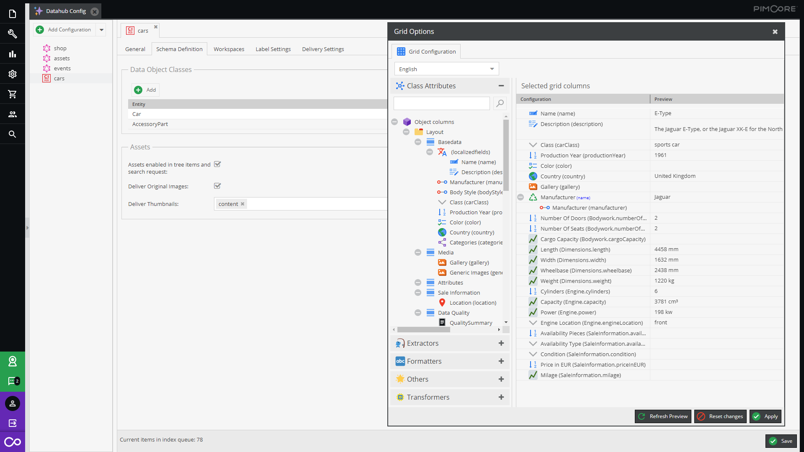

[](LICENSE.md)
[](https://packagist.org/packages/ci-hub/pimcore-ci-hub-adapter-bundle)

This bundle integrates [CI HUB](https://ci-hub.com/) to [Pimcore DataHub](https://github.com/pimcore/data-hub)
and therefore allows integrating Pimcore Assets and DataObjects directly into Adobe and Microsoft products.

## Features in a nutshell
* Configure a schema and expose data like with other DataHub adapters via Drag & Drop.
* Exported data is cached to get a high performance API.
* A token is provided which can be used for connecting CI HUB with your Pimcore DataHub endpoint.



## Installation
This bundle depends on the [Pimcore DataHub](https://github.com/pimcore/data-hub) and the
[Simple REST Adapter](https://github.com/ci-hub-gmbh/SimpleRESTAdapterBundle) bundles. They need to be installed first.

To install the CI HUB Adapter complete following steps:
* Install via composer  
  ```
  composer require ci-hub/pimcore-ci-hub-adapter-bundle
  ```
* Enable via command-line (or inside the Pimcore extension manager)  
  ```
  bin/console pimcore:bundle:enable PimcoreCIHubAdapterBundle
  ```
* Clear cache and reload Pimcore
  ```
  bin/console cache:clear --no-warmup
  ```

> Make sure, that the priority of the Pimcore DataHub is higher than the priority of the Simple REST Adapter,
> and the priority of the Simple REST Adapter is higher than the priority of the CI HUB Adapter.
> This can be specified as parameter of the `pimcore:bundle:enable` command or in the Pimcore extension manager.

## Bundle Configuration
Configure the default thumbnail, which is used by CI HUB to display the preview of your Pimcore Assets:

```yaml
# Default configuration for "CIHubAdapterBundle"
ci_hub_adapter:

    # Default image/document thumbnail settings.
    default_preview_thumbnail:

        # Defaults:
        format:              PNG
        width:               300
        height:              300
        frame:               true
        forceResize:         true
```

> Attention: This configuration is overwritten by any image thumbnail configuration with the name of
> "galleryThumbnail" in the Pimcore Back-End.

## Further Information
Since this bundle is based on the [Simple REST Adapter Bundle](https://github.com/ci-hub-gmbh/SimpleRESTAdapterBundle)
for Pimcore DataHub, see its documentation for details on configuration and usage.

## Planned features
- [ ] Add or update Pimcore Assets via CI HUB interface
- [ ] Identification endpoint with permission details (CRUD)

## License
**CI HUB GmbH**, Benkertstrasse 4, 14467 Potsdam, Germany  
[www.ci-hub.com](https://ci-hub.com), info@ci-hub.ch  
Copyright © 2021 CI HUB GmbH. All rights reserved.

For licensing details please visit [LICENSE.md](LICENSE.md) 
